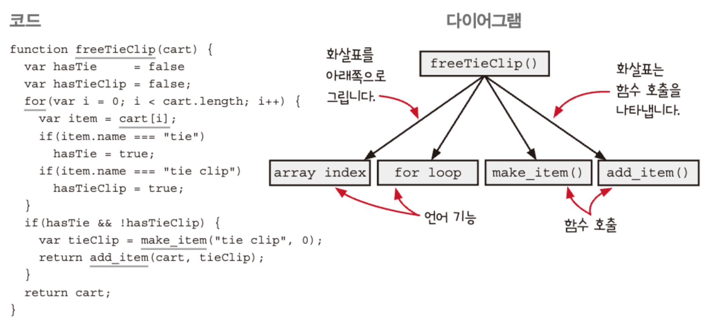
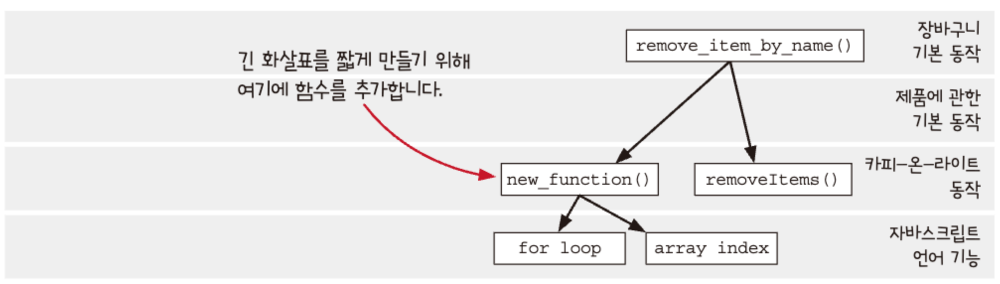

# 계층형 설계 1

소프트웨어 설계란?

코드를 만들고, 테스트하고, 유지보수하기 쉬운 프로그래밍 방법을 선택하기 위해 미적 감각을 사용하는 것

### 계층형 설계란 무엇인가?

> 계층형 설계는 소프트웨어를 계층으로 구성하는 기술입니다. 

계층에 있는 함수는 바로 아래 계층에 있는 함수를 이용해 정의합니다.

### 계층형 설계 감각을 키우기 위한 입력

함수 본문
- 길이
- 복잡성
- 구체화 단계
- 함수 호출
- 프로그래밍 언어의 기능 사용

계층 구조
- 화살표 길이
- 응집도
- 구체화 단계

함수 시그니처
- 함수명
- 인자 이름
- 인잣값
- 리턴값

### 계층형 설계 감각을 키우기 위한 출력

조직화
- 새로운 함수를 어디에 놓을지 결정
- 함수를 다른 곳으로 이동

구현
- 구현 바꾸기
- 함수 추출하기
- 데이터 구조 바꾸기

변경
- 새 코드를 작성할 곳 선택하기
- 적절한 수준의 구체화 단계 결정하기

### 계층형 설계 패턴

패턴 1 : 직접 구현

패턴 2 : 추상화 벽

패턴 3 : 작은 인터페이스

패턴 4 편리한 계층

### 패턴 1 : 직접 구현

서로 다른 추상화 단계에 있는 기능을 사용하면 직접 구현 패턴이 아닙니다.

같은 계층에 있는 함수는 같은 목적을 가져야 합니다.

호출 그래프를 만들어 함수 호출을 시각화하기

### 3단계 줌 래벨

1. 계층 사이에 상호 관계
2. 특정 계층의 구현
3. 특정 함수의 구현

같은 길이의 화살표를 가지는 방법은 중간에 함수를 두는 것입니다.

### 직접 구현 패턴 리뷰

- 직접 구현한 코드는 한 단계의 구체화 수준에 관한 문제만 해결합니다.

- 계층형 설계는 특정 구체화 단계에 집중할 수 있게 도와줍니다

- 호출 그래프는 구체화 단계에 대한 풍부한 단서를 보여줍니다.

- 함수를 추출하면 더 일반적인 함수로 만들 수 있습니다.

- 일반적인 함수가 많을수록 재사용하기 좋습니다.

- 복잡성을 감추지 않습니다.

### 결론

- 계층형 설계는 코드를 추상화 계층으로 구성합니다. 각 계층을 볼 때 다른 계층에 구체적인 내용을 몰라도 됩니다.

- 문제 해결을 위한 함수를 구현할 때 어떤 구체화 단계로 쓸지 결정하는 것이 중요합니다. 그래야 어떤 함수가 어떤 계층에 속할지 알 수 있습니다.

- 함수가 어떤 계층에 속한지 알려주는 요소는 많이 있습니다. 함수 이름과 본문, 호출 그래프 등이 그런 요소입니다.

- 함수 이름은 의도를 알려줍니다. 비슷한 목적의 이름을 가진 함수를 함계 묶을 수 있습니다.

- 함수 본문은 중요한 세부 사항을 알려줍니다. 함수 본문은 함수가 어떤 계층 구조에 있어야 하는지 알려줍니다.

- 호출 그래프로 구현이 직접적이지 않다는 것을 알 수 있습니다. 함수를 호출하는 화살표가 다양한 길이를 가지고 있다면 직접 구현되어 있지 않다는 신호입니다.

- 직접 구현 패턴은 함수를 명확하고 아름답게 구현해 계층을 구성할 수 있도록 알려줍니다.